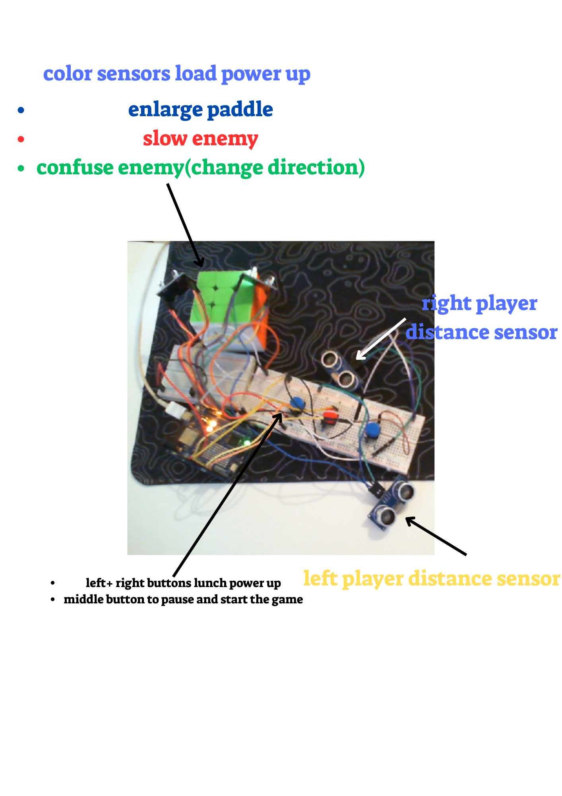

# Pong Game Controlled by Arduino

This is a Pong game controlled by an Arduino using distance and color sensors. The distance sensors control the paddles' movements, while the color sensors activate power-ups in the game. The game runs on Python with a Tkinter GUI, communicating with the Arduino via serial communication.
## Project Setup


## Watch the Game in Action
[Watch the Pong Game Video](example.mp4)
## Features
- **Paddle Control:** Distance sensors control the movement of the paddles.
- **Power-Ups:** Color sensors trigger power-ups, such as enlarging paddles or slowing down the opponent.
- **Game Mechanics:** Python (Tkinter) handles the game logic, interface, and gameplay mechanics.
- **Arduino Integration:** Arduino communicates with the Python script using serial communication to send commands and sensor data.

## Tools and Technologies
- **Arduino Uno:** Microcontroller that interfaces with distance and color sensors.
- **Python (Tkinter):** GUI library for creating the Pong game interface.
- **Serial Communication:** Used to send data between Arduino and Python.
- **Distance Sensors (HC-SR04):** Used to control the paddles' positions.
- **Color Sensors (TCS3200):** Used to trigger power-ups during the game.

## Setup Instructions

### Hardware Setup
1. **Connect the Distance Sensors** to the Arduino pins according to your wiring setup.
2. **Connect the Color Sensors** to the appropriate pins.
3. Upload the Arduino sketch to your Arduino board using the Arduino IDE.

### Software Setup
1. Clone or download this repository to your local machine.
2. Install Python 3 and the required libraries:
   ```bash
   pip install pyserial
   ```
3. Make sure your Arduino is connected to the correct COM port, and update the code in the Python script where necessary (e.g., `COM8`).
4. Run the `pong_game.py` file:
   ```bash
   python pong_game.py
   ```

## How to Play
1. Start the game by clicking the "Start Game" button.
2. Use the distance sensors to control the paddles. The left sensor controls the left paddle, and the right sensor controls the right paddle.
3. Color sensors can activate power-ups to enhance your gameplay.
4. The game ends after a set number of points or time.

## Contributions
Feel free to fork this repository and make your own improvements or bug fixes. Contributions are always welcome!

## License
This project is licensed under the MIT License - see the [LICENSE](LICENSE) file for details.

---

This README file covers the essential information: project description, setup instructions, features, and technologies. Feel free to modify it as needed!
